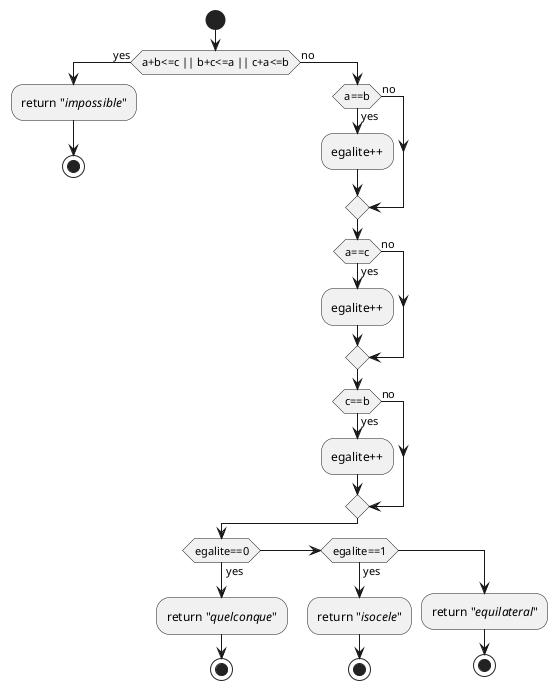

# Premier Titre

Ceci est un exemple de texte

  cf. [MUL_Markdown.md](MUL_Markdown.md) pour plus de détails.

## Voici un sous titre

### Et un sous sous titre

> C'est quoi ce signe Supérieur ? Ca semble mettre un bloc face à un trait bleu

$1 + 1 = 2$

$\sqrt{\frac{x^2}{3}}$

$x_{1,2} = \frac{- b \pm \sqrt{\Delta}}{2a}$

$\begin{bmatrix}
   a_1 & b_1 \\
   a_2 & b_2 
\end{bmatrix}$

$\sum_{x=0}^n f(x)$

### Encore un sous sous titre

"bash" semble servir à insérer un bloc qui ressemble à la commande dos

```bash
cd Kit_markdown-master
make_all.batp
dir out
```

### Un troisième sous titre

> Un bloc "json" ? 

```json
{
    "pandoc.docxOptString": "liste d'options",
}
```


Une liste :
- `<Ctrl>+<k>` +  `p` + `h` : document HTML
- `<Ctrl>+<k>` +  `p` + `d` : document Microsoft Word (*docx*)
- `<Ctrl>+<k>` +  `p` + `p` : document PDF (via Latex)

Les double étoiles encadrent un mot à mettre en **gras**


# toto

essai de diagramme


